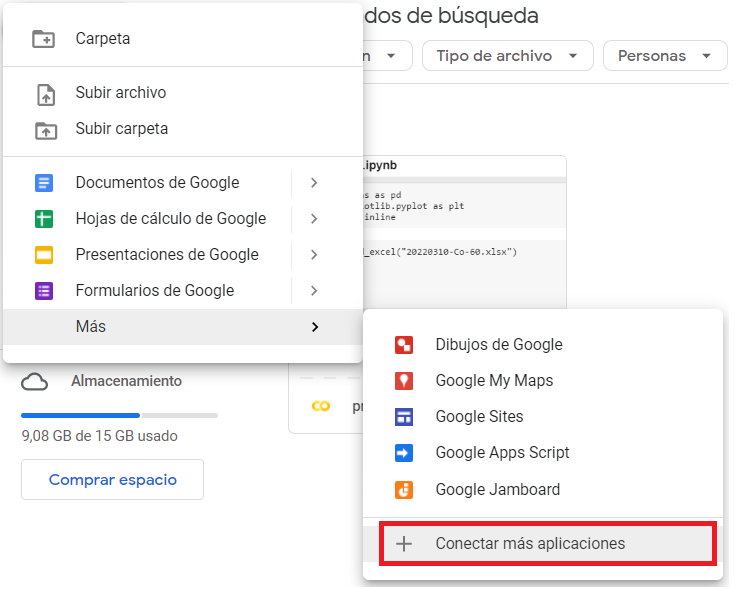
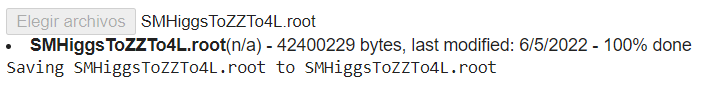
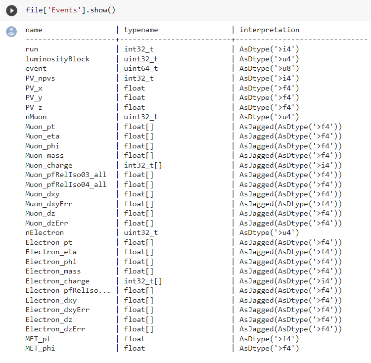
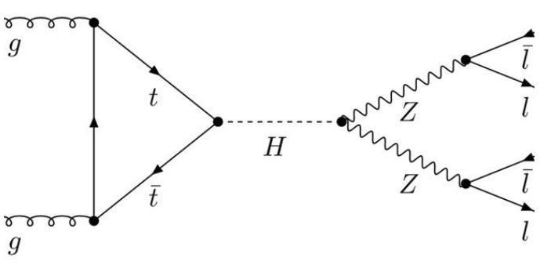

## Desafío: 
-Generar código/Script para convertir los datasets a formato comercial (se escogió .csv).

-Usar solo librerías python comerciales y de libre acceso para análisis de data parcial del Bosón de Higgs.

-Generar un gráfico en matplotlib (o similar) de la masa invariante de 4 leptones.

## Codificación de solución
Dentro del repositorio de GitHub se han creado dos archivos: <b>root_to_csv.ipynb</b> y <b>CMS_Higgs_plot.ipynb</b>. EL primero describe la transformación del archivo .ROOT original a .csv, mientras el segundo describe el manejo de la data para crear un histograma.

### Pasos previos

Hemos obtenido la data desde el sitio web [opendata CERN](http://opendata.web.cern.ch/record/12361), donde usando la herramienta colaborativa de Google desde el Google Drive, se ha originado un archivo codificado en Python. El archivo obtenido es un .ROOT, el cual no es comercial ni fácil de utilizar directamente, lo cual limita su uso. Uno de los objetivos principales de nuestro trabajo es crear un código en Python que convierta este .ROOT en un archivo separado por comas en EXCEL, el cual permita la difusión del trabajo y deje la data al alcance de todos.

Lo primero que debemos hacer es instalar en el Google Drive la herramienta Colaboratory, disponible en la sección de más herramientas al dar click en el <b>+</b> de Google Drive en la parte superior izquierda.



Dentro de Market Place, buscamos la aplicación Colaboratory (en la imagen siguiente se muestra que ya está instalada).


Se procede a crear un archivo nuevo de tipo colaborativo, donde se realizará la programación. 

### Conversión de archivo .ROOT a formato Excel .csv
Como primer paso debemos realizar la instalación de la libreria <b>uproot</b>. Esta nos permitirá leer el archivo .ROOT y poder procesarlo. NOTA: Para ejecutar el código se debe dar click en un botón "play" a la izquierda del código.

```markdown
!pip install uproot awkward #
```

A continuación, se deben declarar las librerias a utilizar. Para resolver nuestra problemática utilizaremos funciones conocidas y básicas dentro de Python:

```markdown
import uproot
import pandas as pd
import numpy as np
import matplotlib.pyplot as plt
from scipy import constants
```

Como observamos, necesitaremos de la libreria uproot para abrir el .ROOT, de pandas para manejo y análisis de estructuras de datos, numpy para manejo de datos y cálculos asociados, además de matplotlib.pyplot para las gráficas necesarias. La librería scipy se utiliza para los valores de las constantes en la Física, de caso puntual, la constante de la velocidad de la luz en el vacío.

Procederemos a subir el archivo con la data a procesar. En el código mostrado a continuación, al ser ejecutado, se mostrarán dos botones <b>Elegir Archivo</b> y <b>Cancelar</b> mientras ejecuta la segunda línea y espera por su decisión. <b>Elegir Archivo</b> le permitirá buscar en su computador el archivo de datos. Para nuestra solución, utilizaremos el archivo <b>SMHiggsToZZTo4L.root</b>.
```markdown
from google.colab import files
uploaded = files.upload()
```
Debemos verificar que el archivo termine de cargarse correctamente. Para esto, deberemos observar el progreso y que la barra termine de cargar. La siguiente imagen muestra el mensaje final del proceso:



Lo siguiente es leer el archivo cargado usando la librería <b>uproot</b> para poder manejar los datos.

```markdown
file = uproot.open("SMHiggsToZZTo4L.root")
```

Como un paso de verificación, se puede usar el código a continuación que permite visualizar las variables (head columns) del archivo de datos.
```markdown
file['Events'].show()
```


Declararemos la variable <b>events</b> para proceder a crear los archivos panda.
```markdown
events = file['Events']
```

Los archivos panda nos permitiran el análisis discriminado de data. Esto es para poder separar los eventos donde se detectan muones y electrones. Como podemos observar en la siguiente figura, se presenta un diagrama de Feynman, el cual inicia con el proceso de  producción de un boson de Higgs, la partículas entrantes son gluones, uno de cada protón de la colisión. Luego se desintegra en un par de bosones Z  y posteriormente vuelve a desintegrarse en 4 leptones



Realizamos la extensión <b>.arrays</b> para seleccionar las columnas que contengan especificos según la partícula a analizar.

### Para datos de muones:

```markdown
datos_pandas = events.arrays(['run', 'luminosityBlock', 'event','PV_npvs', 'PV_x', 'PV_y', 'PV_z', 'nMuon', 'Muon_pt', 'Muon_eta', 'Muon_phi', 'Muon_mass', 'Muon_charge', 'Muon_pfRelIso03_all', 'Muon_pfRelIso04_all', 'Muon_dxy', 'Muon_dxyErr', 'Muon_dz', 'Muon_dzErr'], library = 'pd')
```
Visualizaremos los datos escogidos en el panda usando el código:
```markdown
datos_pandas
```
### Para datos de electrones:
```markdown
datos_pandas2 = events.arrays(['run', 'luminosityBlock', 'event','PV_npvs', 'PV_x', 'PV_y', 'PV_z', 'nElectron','Electron_pt', 'Electron_eta', 'Electron_phi', 'Electron_mass', 'Electron_charge', 'Electron_pfRelIso03_all', 'Electron_dxy', 'Electron_dxyErr', 'Electron_dz', 'Electron_dzErr', 'MET_pt', 'MET_phi'], library = 'pd')
```
Visualizaremos los datos escogidos en el panda usando el código:
```markdown
datos_pandas2
```

Con los pasos anteriores verificamos los valores NaN en las columnas asociadas a electrones en eventos de muones, y visceversa. Procederemos a realizar la concatenación de datos en un solo archivo, además de ordenar la data por el número de evento.
```markdown
datos_pandas_totales = pd.concat([datos_pandas,datos_pandas2])
datos_pandas_totales.sort_index(axis = 0, level = 0, inplace = True)
```
Como último paso, realizaremos la obtención de la data en un formato Excel .csv utilizando la codificación siguiente. La última línea de codificación es para descargar el archivo creado, que para nuestro caso se llamará <b>SMHiggsToZZTo4L.csv</b>.

```markdown
from google.colab import files

datos_pandas_totales.to_csv('SMHiggsToZZTo4L.csv', encoding = 'utf-8-sig') 
files.download('SMHiggsToZZTo4L.csv')
```

## Manejo de CMS Data y Plot de Higgs

Una vez se tenga la data en un formato sencillo, se puede trabajar con ella para realizar cálculos y gráficas.
Declararemos las librerias necesarias para la programación. Consta de las antes descritas panda, numpy y matplotlib.pyplot.

```markdown
import pandas as pd
import numpy as np
import matplotlib.pyplot as plt
```
Debemos realizar la carga del archivo al Goolge Colaboratory:
```markdown
from google.colab import files
uploaded = files.upload()
```
Al ejecutarse, nuevamente se mostrarán dos botones, de los cuales, <b>"Encontrar Archivo"</b> le permitirá subir el archivo con extensión .csv requerido. En nuestro caso será <b>SMHiggsToZZTo4L.csv</b> obtenido en la procedimiento anterior.
El siguiente paso es ingresar el contenido del archivo .csv a una variable para el manejo de los datos>
```markdown
datos_desde_csv = pd.read_csv('SMHiggsToZZTo4L.csv', index_col = [0,1])
```
### Primera fase: filtrado de eventos

Dentro del reto, se ha planteado la visualización de histograma de un ejemplo análisis de Higgs para 4 leptones. Por tanto, de todos los datos que se tiene, se debe escoger solo aquellos eventos que tuvieron como resultado 4 leptones a partir de los 2 muones Z.

Se plantea el código siguiente:
```markdown
#Se eligen los eventos que tiene 4 o más muones
df_4mu = datos_desde_csv.loc[datos_desde_csv['nMuon'] >= 4]

#Se busca que los datos tengan buen aislamiento
df_iso_4mu = df_4mu.loc[np.abs(df_4mu['Muon_pfRelIso04_all']) < 0.4].copy()

#Se busca que los datos esten cercanos al vértice principal y que tengan poca incertidumbre
df_iso_4mu['Muon_ip3d'] = np.sqrt(np.power(df_iso_4mu['Muon_dxy'],2) + np.power(df_iso_4mu['Muon_dz'],2))
df_iso_4mu['Muon_sip3d'] = np.divide( df_iso_4mu['Muon_ip3d'],np.sqrt(np.power(df_iso_4mu['Muon_dxyErr'],2) + np.power(df_iso_4mu['Muon_dzErr'],2)))
df_uncer_4mu = df_iso_4mu.loc[(df_iso_4mu['Muon_sip3d']<4) & (np.abs(df_iso_4mu['Muon_dxy'])< 0.5)&(np.abs(df_iso_4mu['Muon_dz'])<1.0)].copy()

#Nos aseguramos que solo quedan 4 muones en cada evento
df_uncer_4mu['rnMuon'] = df_uncer_4mu.groupby(level = 0).run.transform('sum')

#Se busca que hayan 4 muones, 2 con carga positiva y 2 con carga negativa
df_uncer_4mu['Muon_Charge_Sum'] = df_uncer_4mu.groupby(level = 0).Muon_charge.transform('sum')
df_filt_4mu = df_uncer_4mu.loc[(df_uncer_4mu['rnMuon']==4) & (df_uncer_4mu['Muon_Charge_Sum'] == 0.0)]
```


Lo siguiente es realizar la búsqueda de datos de importancia para el ánalisis.
```markdown
df_4mu = datos_desde_csv.loc[datos_desde_csv['nMuon'] >= 4] #numero de muones mayor o igual a 4
```
## Información de Colaboradores
### Equipo 10: Los Discípulos del Modelo Estándar - Hackaton 2022 CoAfina
- Gabriel Barreto
- Lizbeth Lara
- Senayda Ortiz
- Luis Pabón
- María Porras

