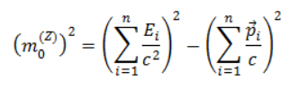
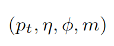
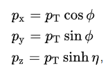
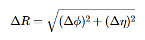
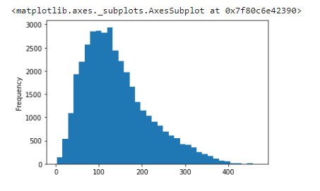

## Desafío: 
-Generar código/Script para convertir los datasets a formato comercial (se escogió .csv).

-Usar solo librerías python comerciales y de libre acceso para análisis de data parcial del Bosón de Higgs.

-Generar un gráfico en matplotlib (o similar) de la masa invariante de 4 leptones.

## Codificación de solución
Dentro del repositorio de GitHub se han creado dos archivos: <b>root_to_csv.ipynb</b> y <b>CMS_Higgs_plot.ipynb</b>. El primero describe la transformación del archivo .ROOT original a .csv, mientras el segundo describe el manejo de la data para crear un histograma.

### Pasos previos

Hemos obtenido la data desde el sitio web [opendata CERN](http://opendata.web.cern.ch/record/12361), donde usando la herramienta colaborativa de Google desde el Google Drive, se ha originado un archivo codificado en Python. El archivo obtenido es un .ROOT, el cual no es comercial ni fácil de utilizar directamente, lo cual limita su uso. Uno de los objetivos principales de nuestro trabajo es crear un código en Python que convierta este .ROOT en un archivo separado por comas, el cual permita la difusión del trabajo y deje la data al alcance de todos.

Lo primero que debemos hacer es instalar en Google Drive la herramienta Colaboratory, disponible en la sección de más herramientas al dar click en el <b>+</b> de Google Drive en la parte superior izquierda.


Dentro de Market Place, buscamos la aplicación Colaboratory (en la imagen siguiente se muestra que ya está instalada).


Se procede a crear un archivo nuevo de tipo colaborativo, donde se realizará la programación. 

### Conversión de archivo .ROOT a formato Excel .csv
Como primer paso debemos realizar la instalación de la libreria <b>uproot</b>. Esta nos permitirá leer el archivo .ROOT y poder procesarlo. NOTA: Para ejecutar el código se debe dar click en un botón "play" a la izquierda del código o se debe apretar Shift+Enter en cada celda.

```markdown
!pip install uproot awkward #
```

A continuación, se deben declarar las librerias a utilizar. Para resolver nuestra problemática utilizaremos funciones conocidas y básicas dentro de Python:

```markdown
import uproot
import pandas as pd
```

Como observamos, necesitaremos de la libreria uproot para abrir el .ROOT y la librería de pandas para manejo y análisis de estructuras de datos.

Procederemos a subir el archivo con la data a procesar. En el código mostrado a continuación, al ser ejecutado, se mostrarán dos botones <b>Elegir Archivo</b> y <b>Cancelar</b> mientras ejecuta la segunda línea y espera por su decisión. <b>Elegir Archivo</b> le permitirá buscar en su computador el archivo de datos. Para nuestra solución, utilizaremos el archivo <b>SMHiggsToZZTo4L.root</b>.
```markdown
from google.colab import files
uploaded = files.upload()
```
Debemos verificar que el archivo termine de cargarse correctamente. Para esto, deberemos observar el progreso y que la barra termine de cargar. La siguiente imagen muestra el mensaje final del proceso:


Lo siguiente es leer el archivo cargado usando la librería <b>uproot</b> para poder manejar los datos.

```markdown
file = uproot.open("SMHiggsToZZTo4L.root")
```

Como un paso de verificación, se puede usar el código a continuación que permite visualizar las variables (head columns) del archivo de datos.
```markdown
file['Events'].show()
```


Declararemos la variable <b>events</b> para proceder a crear los DataFrames de pandas.
```markdown
events = file['Events']
```

Los DataFrames de pandas nos permitiran el análisis discriminado de data. Como podemos observar en la siguiente figura, se presenta un diagrama de Feynman, el cual inicia con el proceso de  producción de un boson de Higgs, la partículas entrantes son gluones, uno de cada protón de la colisión. Luego se desintegra en un par de bosones Z  y posteriormente vuelve a desintegrarse en 4 leptones


Realizamos la extensión <b>.arrays</b> para seleccionar las columnas que contengan especificos según la partícula a analizar.

### Para datos de muones:

```markdown
datos_pandas = events.arrays(['run', 'luminosityBlock', 'event','PV_npvs', 'PV_x', 'PV_y', 'PV_z', 'nMuon', 'Muon_pt', 'Muon_eta', 'Muon_phi', 'Muon_mass', 'Muon_charge', 'Muon_pfRelIso03_all', 'Muon_pfRelIso04_all', 'Muon_dxy', 'Muon_dxyErr', 'Muon_dz', 'Muon_dzErr'], library = 'pd')
```
Visualizaremos los datos escogidos en el panda usando el código:
```markdown
datos_pandas
```
### Para datos de electrones:
```markdown
datos_pandas2 = events.arrays(['run', 'luminosityBlock', 'event','PV_npvs', 'PV_x', 'PV_y', 'PV_z', 'nElectron','Electron_pt', 'Electron_eta', 'Electron_phi', 'Electron_mass', 'Electron_charge', 'Electron_pfRelIso03_all', 'Electron_dxy', 'Electron_dxyErr', 'Electron_dz', 'Electron_dzErr', 'MET_pt', 'MET_phi'], library = 'pd')
```
Visualizaremos los datos escogidos en el panda usando el código:
```markdown
datos_pandas2
```

Con los pasos anteriores verificamos los valores NaN en las columnas asociadas a electrones en eventos de muones, y visceversa. Procederemos a realizar la concatenación de datos en un solo archivo, además de ordenar la data por el número de evento.
```markdown
datos_pandas_totales = pd.concat([datos_pandas,datos_pandas2])
datos_pandas_totales.sort_index(axis = 0, level = 0, inplace = True)
```
Como último paso, realizaremos la obtención de la data en un formato .csv utilizando la codificación siguiente. La última línea de codificación es para descargar el archivo creado, que para nuestro caso se llamará <b>SMHiggsToZZTo4L.csv</b>.

```markdown
from google.colab import files

datos_pandas_totales.to_csv('SMHiggsToZZTo4L.csv', encoding = 'utf-8-sig') 
files.download('SMHiggsToZZTo4L.csv')
```

## Manejo de CMS Data y Plot de Higgs

Una vez se tenga la data en un formato sencillo, se puede trabajar con ella para realizar cálculos y gráficas.
Declararemos las librerias necesarias para la programación. Consta de las antes descritas panda, numpy y matplotlib.pyplot.

```markdown
import pandas as pd
import numpy as np
import matplotlib.pyplot as plt
```
Debemos realizar la carga del archivo al Goolge Colaboratory:
```markdown
from google.colab import files
uploaded = files.upload()
```
Al ejecutarse, nuevamente se mostrarán dos botones, de los cuales, <b>"Encontrar Archivo"</b> le permitirá subir el archivo con extensión .csv requerido. En nuestro caso será <b>SMHiggsToZZTo4L.csv</b> obtenido en la procedimiento anterior.
El siguiente paso es ingresar el contenido del archivo .csv a una variable para el manejo de los datos>
```markdown
datos_desde_csv = pd.read_csv('SMHiggsToZZTo4L.csv', index_col = [0,1])
```
### Primera fase: filtrado de eventos

Dentro del reto, se ha planteado la visualización de histograma de un ejemplo análisis de Higgs para 4 leptones. Por tanto, de todos los datos que se tiene, se debe escoger solo aquellos eventos que tuvieron como resultado 4 leptones a partir de los 2 muones Z.

Se plantea el código siguiente:
```markdown
#Se eligen los eventos que tiene 4 o más muones
df_4mu = datos_desde_csv.loc[datos_desde_csv['nMuon'] >= 4]

#Se busca que los datos tengan buen aislamiento
df_iso_4mu = df_4mu.loc[np.abs(df_4mu['Muon_pfRelIso04_all']) < 0.4].copy()

#Se busca que los datos esten cercanos al vértice principal y que tengan poca incertidumbre
df_iso_4mu['Muon_ip3d'] = np.sqrt(np.power(df_iso_4mu['Muon_dxy'],2) + np.power(df_iso_4mu['Muon_dz'],2))
df_iso_4mu['Muon_sip3d'] = np.divide( df_iso_4mu['Muon_ip3d'],np.sqrt(np.power(df_iso_4mu['Muon_dxyErr'],2) + np.power(df_iso_4mu['Muon_dzErr'],2)))
df_uncer_4mu = df_iso_4mu.loc[(df_iso_4mu['Muon_sip3d']<4) & (np.abs(df_iso_4mu['Muon_dxy'])< 0.5)&(np.abs(df_iso_4mu['Muon_dz'])<1.0)].copy()

#Nos aseguramos que solo quedan 4 muones en cada evento
df_uncer_4mu['rnMuon'] = df_uncer_4mu.groupby(level = 0).run.transform('sum')

#Se busca que hayan 4 muones, 2 con carga positiva y 2 con carga negativa
df_uncer_4mu['Muon_Charge_Sum'] = df_uncer_4mu.groupby(level = 0).Muon_charge.transform('sum')
df_filt_4mu = df_uncer_4mu.loc[(df_uncer_4mu['rnMuon']==4) & (df_uncer_4mu['Muon_Charge_Sum'] == 0.0)]
```


### Segunda fase: Apareamiento de muones que pueden generar un bosón Z

Luego de haber separado los eventos de interés, procederemos a elegir los 2 muones de carga contraria y que además al sumar sus energías y momentums podemos acercarnos a la masa del bosón Z de acuerdo a la siguiente ecuación:



Los datos del CERN vienen en vectores de momentum en 4D (cuadrimomentums) con la métrica (-,-,-,+) de la siguiente forma



donde pt es el momentum transverso, eta la pseudorapidez, phi el \'angulo de azimuth y m la masa. Para poder pasar estos vectores al vector de cuadrimomentum en coordenadas cartesianas, debemos hacer.



El código a continuación se encarga de hacer estos cálculos

```markdown
#Definimos la función que calcula la masa a partir de 2 cuadrimomentums
def calc_mass(pt1,eta1,phi1,mass1,pt2,eta2,phi2,mass2):
  px1 = pt1*np.cos(phi1)
  py1 = pt1*np.sin(phi1)
  pz1 = pt1*np.sinh(eta1)
  px2 = pt2*np.cos(phi2)
  py2 = pt2*np.sin(phi2)
  pz2 = pt2*np.sinh(eta2)
  return np.sqrt(np.power((mass1 + mass2),2) + (np.power((px1 +px2),2) + np.power((py1 + py2),2) + np.power((pz1 + pz2),2)))

#Realizamos una función que elije en cada evento el mejor par de muones que logran crear un Boson Z
def best_Z(df):
  mu_pt = df['Muon_pt'].reset_index(drop = True).to_numpy()
  mu_eta = df['Muon_eta'].reset_index(drop = True).to_numpy()
  mu_phi = df['Muon_phi'].reset_index(drop = True).to_numpy()
  mu_mass = df['Muon_mass'].reset_index(drop = True).to_numpy()
  mu_charge = df['Muon_charge'].reset_index(drop = True).to_numpy()
  zmass = 91.2
  bestmass = -1
  idx=[0,0]
  for i in range(0,mu_charge.size):
    for j in range(i+1,mu_charge.size):
      if(mu_charge[i] != mu_charge[j]):
        thismass = calc_mass(mu_pt[i],mu_eta[i],mu_phi[i],mu_mass[i],mu_pt[j],mu_eta[j],mu_phi[j],mu_mass[j])
        #print(thismass)
        if(np.abs(zmass - thismass) < np.abs(zmass - bestmass)):
          bestmass = thismass
          idx[0] = i
          idx[1] = j
  idy = np.ones(mu_charge.size)
  idy[idx[0]] = 0
  idy[idx[1]] = 0
  npidy = np.array(idy)
  df = df.reset_index()
  extra = pd.DataFrame(npidy,columns = ['Idx'])
  final = pd.concat([df,extra], axis=1)
  final.set_index(['entry','subentry'], drop = True, inplace = True)
  return final
  ```
  
  Luego de tener las funciones listas se las aplicamos a los datos. Tratando de hacerlo lo más vectorizado posible, al tomar set de datos por evento. Si tomáramos los datos uno por uno, el programa tardaría más en realizar estos cálculos. 
  
  ```markdown
#Señalamos en una nueva columna cuáles son los mejores muones que logran crear un bosón Z
df_bestZ_4mu = df_filt_4mu.groupby(level = 0).apply(best_Z)
  ```


### Tercera fase: 

En esta fase calculamos la separación entre los muones que deseamos utilizar para reconstruir el bosón Z. Para eso utilizamos el parámetro Delta R que viene dado por



El siguiente código realiza este cálculo.

  ```markdown
#Creamos una función que calcule la diferencia en pseudorapidez y el ángulo entre 2 vectores
def distance(df):
  mu_eta = df['Muon_eta'].reset_index(drop = True).to_numpy()
  mu_phi = df['Muon_phi'].reset_index(drop = True).to_numpy()
  idx = df['Idx'].reset_index(drop = True).to_numpy()
  dr = np.zeros(idx.size)
  for i in range(0,idx.size):
    for j in range(i+1, idx.size):
      if(idx[i] == idx[j]):
        delta_r = np.sqrt(np.power(mu_eta[i] + mu_eta[j],2) + np.power(mu_phi[i] + mu_phi[j],2))
        dr[i] = delta_r
        dr[j] = delta_r
  df = df.reset_index()
  extra = pd.DataFrame(dr,columns = ['Delta_R'])
  final = pd.concat([df,extra], axis=1)
  final.set_index(['entry','subentry'], drop = True, inplace = True)
  return final
  ```
Luego se eliminan los muones que son cercanos. Para ello tomamos de referencia el valor de Delta_R

```markdown
#Se eliminan los muones que son cercanos en pseudorapidez y ángulo
df_deltaR_4mu = df_bestZ_4mu.groupby(level = 0).apply(distance)
df_cut_deltaR_4mu = df_deltaR_4mu.loc[df_deltaR_4mu['Delta_R'] > 0.02].copy()

#Nos aseguramos que solo quedan 4 muones en cada evento
df_cut_deltaR_4mu['rrnMuon'] = df_cut_deltaR_4mu.groupby(level = 0).run.transform('sum')
df_f_deltaR_4mu = df_cut_deltaR_4mu.loc[(df_cut_deltaR_4mu['rrnMuon']==4)].copy()
  ```

### Cuarta Fase: Calcular la masa de bosón Z a partir de muones

En esta fase ya calculamos la masa de los bosones Z a partir de los 4 muones seleccionados en cada evento.

```markdown
#Creamos una función para crear la masa de los bosones Z
def create_Z(df):
  mu_pt = df['Muon_pt'].reset_index(drop = True).to_numpy()
  mu_eta = df['Muon_eta'].reset_index(drop = True).to_numpy()
  mu_phi = df['Muon_phi'].reset_index(drop = True).to_numpy()
  mu_mass = df['Muon_mass'].reset_index(drop = True).to_numpy()
  idx = df['Idx'].reset_index(drop = True).to_numpy()
  dz = np.zeros(idx.size)
  for i in range(0,idx.size):
    for j in range(i+1, idx.size):
      if(idx[i] == idx[j]):
        z_mass = calc_mass(mu_pt[i],mu_eta[i],mu_phi[i],mu_mass[i],mu_pt[j],mu_eta[j],mu_phi[j],mu_mass[j])
        dz[i] = z_mass
        dz[j] = z_mass
  df = df.reset_index()
  extra = pd.DataFrame(dz,columns = ['Z_mass'])
  final = pd.concat([df,extra], axis=1)
  final.set_index(['entry','subentry'], drop = True, inplace = True)
  return final
  ```
  
  Aplicamos la función creada a los datos.
  
  ```markdown
  #Aplicamos la función
df_withZ_4mu = df_f_deltaR_4mu.groupby(level = 0).apply(create_Z)
  ```

### Quinta fase: Seleccionar Z que pueden ser bosón de Higgs
Los bosones Z que hemos encontrado y estan en los extremos con muy poca energía o mucha energía los descartamos.
   ```markdown
  #Eliminamos los eventos que no tienen bosones de Higgs en el rango (12,120)
df_cutZ_4mu = df_withZ_4mu.loc[(df_withZ_4mu['Z_mass'] > 12) & (df_withZ_4mu['Z_mass'] < 120)].copy()

#Nos aseguramos que solo quedan 4 muones en cada evento
df_cutZ_4mu['rrrnMuon'] = df_cutZ_4mu.groupby(level = 0).run.transform('sum')
df_cutZ_4mu = df_cutZ_4mu.loc[(df_cutZ_4mu['rrrnMuon']==4)]
  ```

### Sexta Fase: Recrear la masa del bosón de Higgs

Finalmente con los 4 muones calculamos la masa que debería tener el boson de Higgs que decayó y dió lugar a los 4 muones que hemos seleccionado en cada evento.

 ```markdown
#Realizamos una función que cálcule la masa del Boson de Higgs a partir de 4 leptones
def calc_massH(pt1,eta1,phi1,mass1,pt2,eta2,phi2,mass2,pt3,eta3,phi3,mass3,pt4,eta4,phi4,mass4):
  px1 = pt1*np.cos(phi1)
  py1 = pt1*np.sin(phi1)
  pz1 = pt1*np.sinh(eta1)
  px2 = pt2*np.cos(phi2)
  py2 = pt2*np.sin(phi2)
  pz2 = pt2*np.sinh(eta2)
  px3 = pt2*np.cos(phi2)
  py3 = pt2*np.sin(phi2)
  pz3 = pt2*np.sinh(eta2)
  px4 = pt2*np.cos(phi2)
  py4 = pt2*np.sin(phi2)
  pz4 = pt2*np.sinh(eta2)
  return np.sqrt(np.power((mass1 + mass2 + mass3 + mass4),2) + (np.power((px1 +px2 + px3 + px4),2) + np.power((py1 + py2 + py3 + py4),2) + np.power((pz1 + pz2 + pz3 + pz4),2)))

#Hacemos la función para recrear la masa del Boson de Higgs
def create_H(df):
  mu_pt = df['Muon_pt'].reset_index(drop = True).to_numpy()
  mu_eta = df['Muon_eta'].reset_index(drop = True).to_numpy()
  mu_phi = df['Muon_phi'].reset_index(drop = True).to_numpy()
  mu_mass = df['Muon_mass'].reset_index(drop = True).to_numpy()
  idx = df['Idx'].reset_index(drop = True).to_numpy()
  dH = np.ones(idx.size)
  H_mass = calc_massH(mu_pt[0],mu_eta[0],mu_phi[0],mu_mass[0],mu_pt[1],mu_eta[1],mu_phi[1],mu_mass[1],mu_pt[2],mu_eta[2],mu_phi[2],mu_mass[2],mu_pt[3],mu_eta[3],mu_phi[3],mu_mass[3])
  dH = dH * H_mass
  df = df.reset_index()
  extra = pd.DataFrame(dH,columns = ['H_mass'])
  final = pd.concat([df,extra], axis=1)
  final.set_index(['entry','subentry'], drop = True, inplace = True)
  return final
  ```
Finalmente aplicamos las funciones a los datos
```markdown
#Colocamos los datos calculados en el DataFrame
df_withH_4mu = df_cutZ_4mu.groupby(level = 0).apply(create_H)
  ```
y llegamos a la etapa más esperada, graficar los datos y ver si estamos cerca de encontrar el Boson de Higgs

### Graficación de datos obtenidos

Finalmente logramos hacer la siguiente gráfica. En este caso la realizamos rápidamente con las mismas funciones de Pandas (que son heredadas de matplotlib.pyplot)

```markdown
#Realizamos el Histograma
df_withH_4mu['H_mass'].plot.hist(bins = 36)
  ```
 
  
En el histograma, podemos ver que la mayor cantidad de eventos son justamente muy cercanos a los 125 GeV. ¡Y esto coincide con el Bosón de Higgs!


## ¿Qué falta?
El reto fue desarrollado por 5 físicos con poca experiencia previa en manejo de datos con pandas. Pero ahora que finalmente dominamos todas las fases ahora podriamos:

-Adaptar el código para otros eventos para la reproducción el Bosón de Higgs, como lo son los eventos de 4 electrones o eventos de 2 muones y 2 electrones

-Realizar las gráficas en conjunto de todos estos eventos


## Información de Colaboradores
### Equipo 10: Los Discípulos del Modelo Estándar - Hackaton 2022 CoAfina
- Gabriel Barreto
- Lizbeth Lara
- Senayda Ortiz
- Luis Pabón
- María Porras

